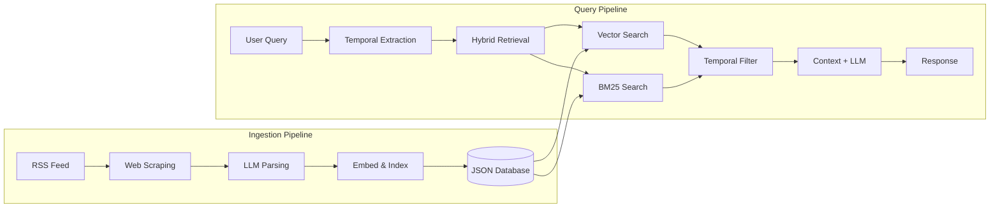

# TransitMate: Translink Service Update RAG Chatbot

An intelligent RAG (Retrieval-Augmented Generation) chatbot designed to provide real-time updates and answer questions regarding Translink service disruptions, track closures, and stop changes.

## Motivation

Translink frequently updates its service status through website notices via https://translink.com.au/service-updates and an RSS feed at https://translink.com.au/service-updates/rss. However, users often find it challenging to quickly locate relevant information about specific routes or disruptions. This project aims to streamline access to this information by leveraging advanced retrieval techniques and local LLMs to deliver accurate, context-aware responses.

## Features

- **Real-time Ingestion**: Automatically scrapes the Translink RSS feed for the latest service updates.
- **RAG Capability**: Uses advanced retrieval techniques (BM25 + Semantic Search) to find relevant disruption info.
- **LLM Integration**: Powered by local LLMs via Ollama (defaulting to `qwen3:8b`) for professional, human-like responses.
- **Structured Data Extraction**: Automatically extracts routes, locations, and dates from raw transport notices using LLM-based parsing.
- **Responsive UI**: A modern frontend built with HTML/CSS/JS.

## Tech Stack

- **Backend**: Python, Flask, Flask-CORS
- **RAG Architecture**:
  - `sentence-transformers` for embeddings.
  - `rank_bm25` for keyword retrieval.
  - `ollama` for LLM orchestration.
- **Scraping**: `BeautifulSoup4`, `feedparser`.
- **Frontend**: Pure HTML5, CSS3 (Vanilla), JavaScript (ES6+).

## Examples

<p align="center">
  
  <br>
  <em>Chatbot UI</em>
</p>

<table align="center">
  <tr>
    <td align="center" width="50%">
      <br>
      <br>
      <em>Location Name</em>
    </td>
    <td align="center" width="50%">
      <br>
      <br>
      <em>Route Name</em>
    </td>
  </tr>
</table>

<br>

<table align="center">
  <tr>
    <td align="center" width="50%">
      <br>
      <br>
      <em>Stop Example</em>
    </td>
    <td align="center" width="50%">
      <br>
      <br>
      <em>Event Impact</em>
    </td>
  </tr>
</table>


## Algorithm Overview


## Getting Started

### Prerequisites

1.  **Python 3.10+**
2.  **Ollama**: Install [Ollama](https://ollama.ai/) and pull the required model:
    ```bash
    ollama pull qwen3:8b
    ```

### Installation

1.  **Clone the repository**:

    ```bash
    git clone https://github.com/sanjeevbhurtyal/Translink_Service_Update_RAG_Chatbot.git
    cd Translink_Service_Update_RAG_Chatbot
    ```

2.  **Set up a virtual environment**:

    ```bash
    python -m venv .venv
    source .venv/bin/activate  # On Windows: .venv\Scripts\activate
    ```

3.  **Install dependencies**:
    ```bash
    pip install -r requirements.txt
    ```

### Usage

1.  **Ingest Service Data**:
    Run the ingestion script to fetch and process current Translink service updates.

    ```bash
    python backend/ingest.py
    ```

    _Use `--fresh-start` to clear the database and start fresh._

2.  **Run the Server**:
    Start the Flask backend server.

    ```bash
    python backend/app.py
    ```

3.  **Launch the Frontend**:
    Open `frontend/index.html` in your favorite web browser.

## Project Structure

```text
├── backend/
│   ├── app.py              # Flask API server
│   ├── ingest.py           # RSS scraper and data processing
│   ├── rag.py              # RAG logic (retrieval + LLM)
│   ├── documents.json      # Processed textual data
│   └── vector_store.json   # Local vector database
├── frontend/
│   └── index.html          # Chat interface
├── requirements.txt        # Python dependencies
└── README.md
```

## Limitations

- **Hardware Dependency**: Local LLM performance (Ollama) is highly dependent on system CPU/GPU capabilities.
- **Scraping Sensitivity**: The ingestion pipeline relies on the current structure of the Translink RSS feed and website; changes to their HTML may require scraper updates.
- **Local Storage**: Currently uses JSON-based storage for the vector database and documents, which is suitable for moderate data but not optimized for massive scales.
- **Development Server**: The Flask backend is configured as a development server and should be wrapped in a production-ready WSGI (like Gunicorn) for deployment.

## Future Enhancements

- Add support for Multi-modal retrieval (Map images).

## License

Distributed under the MIT License. See `LICENSE` for more information.
